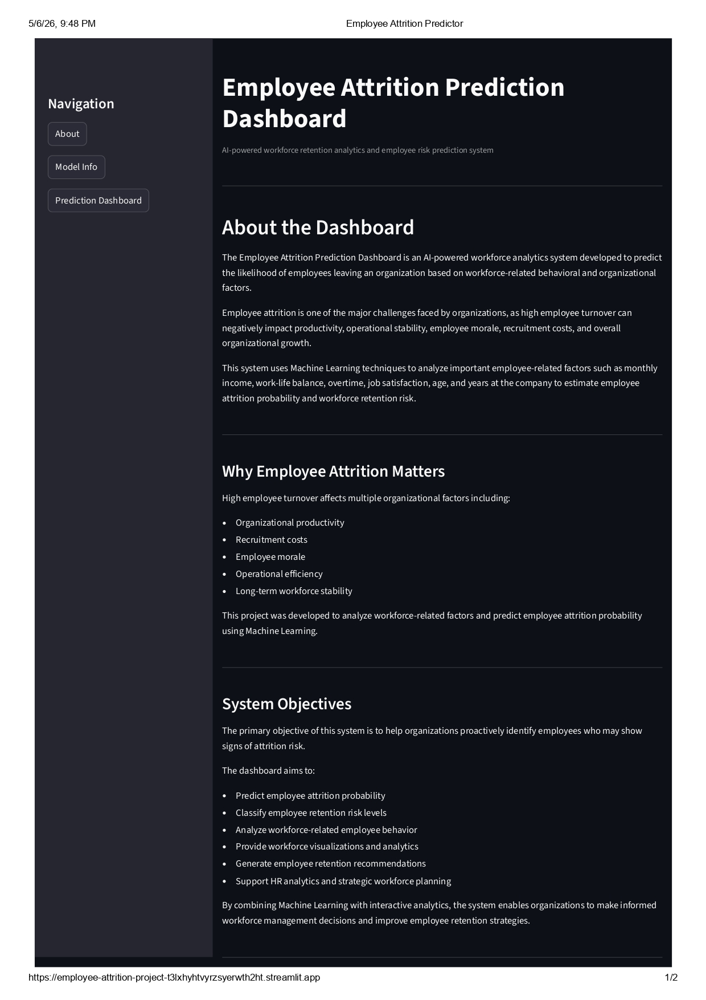
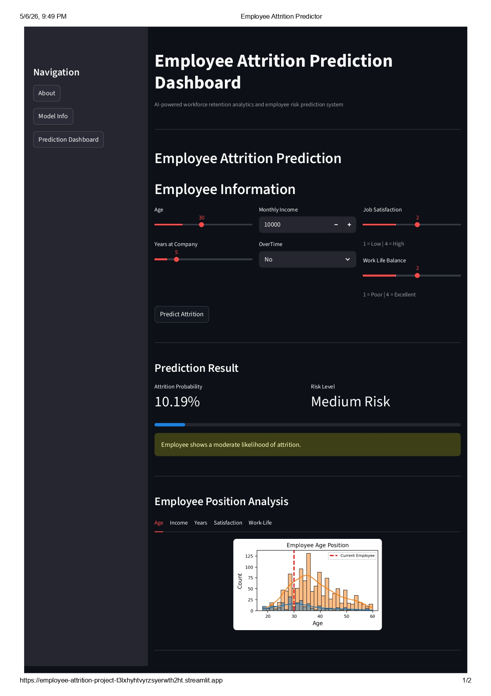

# Employee Attrition Prediction Dashboard

An AI-powered workforce analytics dashboard that predicts employee attrition probability using Machine Learning and Streamlit.

---

## Project Overview

Employee attrition is one of the major challenges faced by organizations, as high employee turnover can negatively impact productivity, operational stability, recruitment costs, employee morale, and workforce stability.

This project was developed to analyze workforce-related behavioral and organizational factors using Machine Learning techniques to estimate employee attrition probability and classify employee retention risk levels.

The system provides an interactive analytics dashboard where users can:

- Predict employee attrition probability
- Analyze employee risk levels
- Visualize employee workforce position
- Generate retention-focused recommendations
- Understand workforce behavior patterns

---

## Features

- Employee Attrition Prediction
- Probability-Based Risk Classification
- Interactive Workforce Analytics Dashboard
- Employee Position Analysis Graphs
- Retention Recommendation System
- Logistic Regression Machine Learning Model
- Streamlit-Based User Interface
- Workforce Visualization and Insights

---

## Machine Learning Model

The project uses a **Logistic Regression** model trained on HR analytics data.

### Selected Features

- Age
- Monthly Income
- Years at Company
- Job Satisfaction
- Work Life Balance
- Overtime

### Model Performance

| Metric | Value |
|---|---|
| Algorithm | Logistic Regression |
| Accuracy | 86.3% |
| Prediction Type | Binary Classification |

---

## Tech Stack

### Frontend
- Streamlit

### Backend
- Python

### Libraries Used
- Pandas
- NumPy
- Scikit-learn
- Matplotlib
- Seaborn

---

## Installation

```bash
git clone https://github.com/your-username/employee-attrition-project.git

cd employee-attrition-project

pip install -r requirements.txt

streamlit run app.py
```

---

## Deployment

The application is deployed using **Streamlit Community Cloud**.

---

## Dashboard Screenshots

### About Section



---

### Prediction Dashboard




---

## Streamlit Deployment URL

### Live Demo

[Open Employee Attrition Dashboard](https://your-app-name.streamlit.app)

---

## Author

### Rajesh kannan

Machine Learning Enthusiast | Python Developer

---

## License

This project is developed for educational and portfolio purposes.
